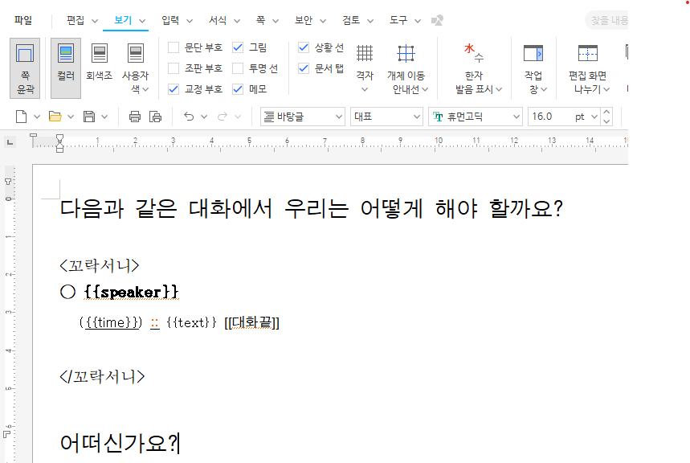
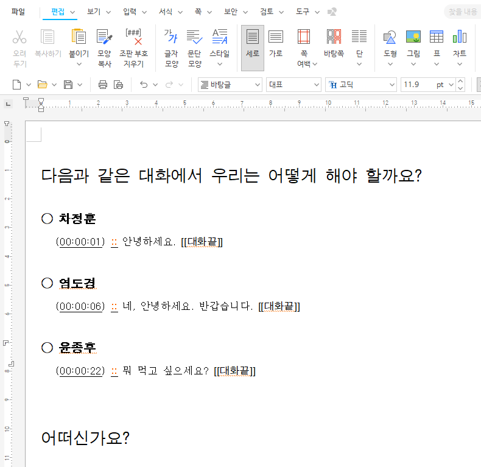

# hwp-template
한글(HWP) 문서를 만들기 위한 템플릿 엔진 입니다.

## Requirement
- Java 8 이상
- ~~Gradle 6.8.3 이상~~ (크게 중요친 않아요😅)

## How to use
1. `hwp-template`을 설치합니다.
    ```bash
    ./gradlew jar
    ```
2. `hwp-template`을 실행합니다.
    ```bash
   java -jar build\libs\hwp-template-0.2.jar src/test/resources/runner/template.hwp src/test/resources/runner/sample.json build/test.hwp
   ```
   - 첫번째 인자는 템플릿 파일의 경로에요.
   - 두번째 인자는 데이터 파일의 경로에요.
   - 세번째 인자는 결과 파일의 경로에요.
3. `build/test.hwp` 파일을 확인 합니다.

## Example
### 템플릿 파일
```json
[
   {
      "speaker": "차정훈",
      "time": "00:00:01",
      "text": "안녕하세요."
   },
   {
      "speaker": "염도경",
      "time": "00:00:06",
      "text": "네, 안녕하세요. 반갑습니다."
   },
   {
      "speaker": "윤종후",
      "time": "00:00:22",
      "text": "뭐 먹고 싶으세요?"
   }
]
```
### HWP Template 파일

#### 규칙
- `<꼬락서니>` 로 시작해서 `</꼬락서니>` 로 끝나는 부분까지 반복되는 템플릿 이에요.
- json 의 key 값과 동일한 이름의 글자를 찾아서 치환 해요.

#### 결과
